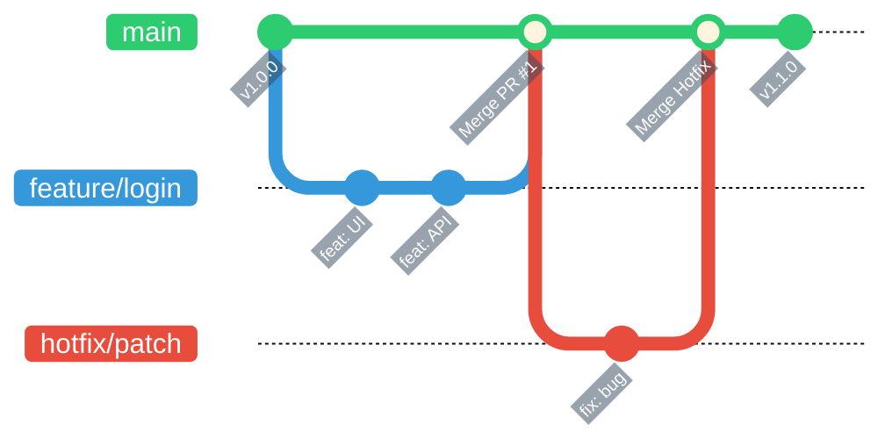

> ref: [How to Use Git and Git Workflows – a Practical Guide](https://www.freecodecamp.org/news/practical-git-and-git-workflows/)
>
> Assuming that the reader already knows about Git and GitHub, I will skip the setup and installation steps and go directly into the Git commands. Just consider this a cheatsheet.

---

# Git clone

As the name suggests, it clones a project from GitHub to your computer.

```
git clone <URL>
```

Note: it will clone everything into the root directory where you run the command. For example, with the command below, it will clone everything into the directory at drive C, folder Users > minhq > Desktop > Proj.

```
PS C:\Users\minhq\Desktop\Proj> git clone <URL>
```

---

# Git branches

As the name suggests, a branch is a separate branch of development. Imagine that you are working on a straight branch called `main`, and branching out from `main` are secondary branches such as 1, 2, x, y, etc. Each branch will eventually be merged back into `main` after we finish working on that secondary branch. Depending on the project, the main branch may be named either `main` or `master`.
I drew an example below. You can see that `main` is the primary branch, or you could call it the official project. While working, suppose my manager asks me to add a UI. Of course, I cannot add it directly to the source code, because if something goes wrong, that would be a serious problem. Therefore, we will handle it in the following order:

- Create the `feature/login` branch.
- Add the UI and API features.
- After confirming that this code does not affect the main project, merge the secondary branch into `main`.
- What if a bug appears after the merge? Then create another secondary branch called `hotfix/patch`, fix the bug, and merge it again. The important point is that you should never work directly on the `main` branch because it is usually the branch currently deployed for customers, products, or the company.



---

# Git status

Syntax:

```
git status
```

This command is used to check what changes you have made. For example, consider the command below. I run `git status` in my portfolio project, and there are two cases:

- `On branch main`: I am currently on the `main` branch.
- `Untracked files` means Git is not tracking those files in the project yet. In this case, it is the `git` folder inside the `posts` folder. This is only the folder name I chose and is not actually related to Git. To track it, I need to run `git add`, which will be discussed later. `status` is only used to check the current state.
- The final line means that the staging area, which contains the changes that need to be saved before being pushed to GitHub, is currently empty. Therefore, there is nothing to commit yet.

```
(.venv) PS C:\Users\minhq\Desktop\Proj\Portfolio> git status
On branch main
Untracked files:
  (use "git add <file>..." to include in what will be committed)
        content/posts/git/

nothing added to commit but untracked files present (use "git add" to track)
```

Now consider this output:

- `On branch main`: I am on the `main` branch.
- `up to date ...`: this means my code matches the current version on `origin/main`, which is my GitHub repository.
- `nothing ...`: there is nothing left to commit, and the branch is clean.

```
(.venv) PS C:\Users\minhq\Desktop\Proj\Portfolio> git status
On branch main
Your branch is up to date with 'origin/main'.
nothing to commit, working tree clean
```

---

# Git commit

`git add`: the dot `"."` means Git will track all current changes. If you do not want that, you can also add only one specific file.

```
git add .
git add text.txt
```

`git commit`: records what you changed or what you did. Depending on the company or project, there may be different naming conventions for commit messages. My habit is to use `"feat: ..."` when adding something new and `"fix: ..."` when fixing a bug. Some places may require a format such as `"[CONFIG] ..."`. The `-m` option allows you to write the commit message directly in the terminal. Otherwise, Git may open Vim or Nano and ask you to type the description there.

```
git commit
git commit -m "messages here"
```

`git log`: used to view what you have done. It provides the commit ID, also called the SHA, the commit author, date, and commit message.

```
git log
```

---

# Git push

After saving the changes with a commit, how do we upload them? Use `git push`. Here, `origin` means GitHub, and `main` is the branch.
Note that the order is always:

- Make some changes.
- Add them.
- Commit them.
- Push them.

```
git push origin main
```

---

# Git diff and Git restore

`git diff` is used to check in detail what you have changed, but I never use it because I usually use PyCharm or Visual Studio, and both provide a UI for viewing changes. `git diff` shows the changes compared with what has been staged, while `--staged` or `--cached` compares the files that have been added to the staging area with the latest commit.
You can also compare the differences between two branches, such as branches 1 and 2, with the final command.

```
git diff
git diff --staged
git diff --cached
git diff 1 2
```

`git restore`: it is basically `Ctrl + Z`. `git restore <file>` completely restores that file, while `git restore --staged <file>` removes the file from the staging area and returns it to the state before `git add`. To restore all tracked files in the current directory that have not been staged, use `git restore .`.

```
git restore .
git restore text.txt
git restore --staged index.md
```

---

# Branches in Git

At a certain point, we may need to create a secondary branch to work on. The `-b` option allows us to skip two separate steps by creating the branch and switching to it immediately.

```
git checkout -b <branch-name>
```

If you do not want to use `-b`, follow the order below: create the branch first and then switch to it using two commands.

```
git branch <branch-name>
git checkout <branch-name>
```

---

# Merging a branch into main

There are two main methods:

1. Merge the changes from the secondary branch into the local `main` branch, then push that local branch to `origin/main`, which is the `main` branch on GitHub.
2. Push the secondary branch to `origin`, which is GitHub, to create `origin/<secondary-branch>`, merge that secondary branch into `origin/main` on GitHub, and then pull the remote `main` branch down to the local `main` branch.

So what is the difference between the two methods?

- Method 1: I do everything myself, review it myself, take responsibility for it on my own computer, and only then push the completed product to the internet.
- Method 2: I push the idea, which is the secondary branch, to the cloud so that the system or my colleagues can review it. When everything is OK, it is merged into `main`, and then I pull the approved version back to my computer.
- In comparison, method 1 is faster for personal projects, while method 2 is more suitable for working in a team.

For method 1, switch back to `main`, merge the branch, push it to GitHub, and delete the secondary branch on your computer.

```
git checkout main
git merge <completed-secondary-branch>
git push origin main
git branch -d <completed-secondary-branch>
```

For method 2, push the secondary branch to `origin`, which is GitHub, so that GitHub creates the secondary branch. Then, on GitHub, create a pull request, which is a request to merge the branch, so that the project manager can review whether the branch affects `main`. The final two commands are used after the branch has been approved and merged into `main`; they pull `origin/main` down to the local machine to synchronize the project.

```
git push origin <created-secondary-branch>
git checkout main
git pull origin main
```

---

# Git fetch

Used to check what changes have occurred on `origin`.

```
git fetch
```

---

# Conflict in Git

Errors can happen at any time. So what happens if two branches are merged into `main` at the same time, they modify the same file, and the contents overlap? Communication can help avoid this, but what if this situation still happens?
Normally, the IDE you use will provide support for handling this.
Open the conflicted file, and it will display something like the command block below. The solution is:

- Remove the unwanted marker lines (`<<<<<<<`, `=======`, `>>>>>>>`).
- Edit the content so that only the version you want to keep remains, or combine both versions.
- Save the file.
- After that, just add, commit, and push.

```
<<<<<<< HEAD
This song was composed in 2024.
=======
This song was composed in 2026 by ABC.
>>>>>>> feature/music-update

--- Explanation ---

<<<<<<< HEAD: The beginning of the content from the current branch.

=======: The separator between the two versions.

>>>>>>> <branch-name>: The end of the content from the branch being merged.
```

`Ctrl + Z` :))

```
git merge --abort
```

The most important thing is still communication to prevent this situation from happening because it is very troublesome.
