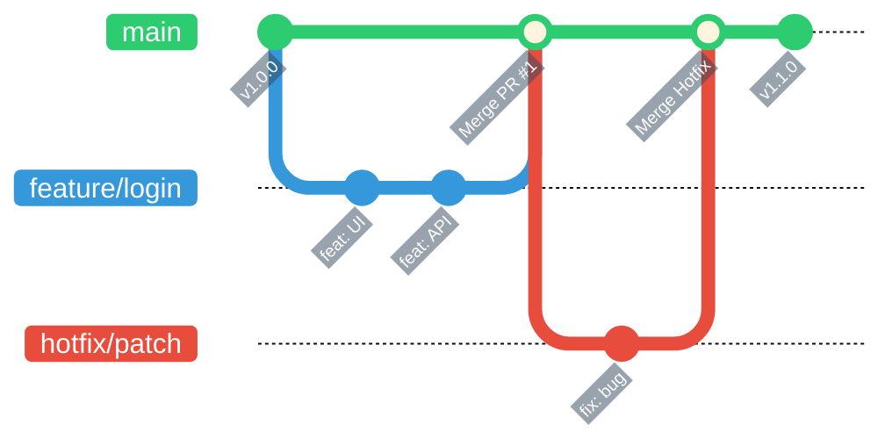

> ref: [How to Use Git and Git Workflows – a Practical Guide](https://www.freecodecamp.org/news/practical-git-and-git-workflows/)
>
> Giả định rằng người đọc đã biết về git và github, mình sẽ skip mấy bước setup và install và đi trực tiếp vào những câu lệnh git, cứ coi như đây là một cheatsheet đi.
---

# Git clone

- Đúng như tên gọi, nó sẽ clone một project trên github về.

```
git clone <URL>
```

- Lưu ý: nó sẽ clone mọi thứ về và để ở trong thư mục root bạn chạy lệnh. Ví dụ với dòng lệnh dưới, nó sẽ clone mọi thứ vào và để ở thư mục với đường dẫn là ổ C, folder Users > minhq > Desktop > Proj.

```
PS C:\Users\minhq\Desktop\Proj> git clone <URL>
```
---
# Git branches

- Tên gọi nó nghĩa là nhánh, tưởng tượng bạn làm việc trên nhánh thẳng là main, và chìa ra từ main sẽ có các nhánh phụ là 1, 2, x, y, etc. và mỗi nhánh đều sẽ gộp lại vào nhánh main sau khi chúng ta hoàn thành nhánh phụ đó. Tùy nhiều dự án người ta có thể để nhánh chính là main hoặc master.
- Mình có vẽ một cái ví dụ bên dưới, có thể thấy nhánh main là nhánh chính hay có thể gọi là dự án chính thức ấy. Trong quá trình làm việc thì mình được quản lý yêu cầu thêm UI, và chắc chắn không thể thêm thằng vào source code rồi, làm vậy mà có vấn đề gì thì lại chết dở nữa nên chúng ta sẽ xử lý theo thứ tự này:
  - Tạo nhánh feature/login.
  - Feat UI và API vô.
  - Xong sau khi xác nhận rằng phần code này không ảnh hưởng gì tới dự án chính, chúng ta sẽ merge nhánh phụ này vào nhánh main.
  - Vậy nếu merge xong lòi ra lỗi thì sao, thì lại tạo nhánh phụ hotfix/patch, fix và merge tiếp, điều quan trọng là không bao giờ được làm trực tiếp trên nhánh main vì thông thường nó là nhánh đang được deploy cho khách hàng/sản phẩm/công ty.


---
# Git status

- Syntax:

```
git status
```

- Lệnh này sử dụng để coi mình đã làm ra những thay đổi gì, ví dụ lệnh dưới đi, mình chạy git status trong project portfolio của mình, nó sẽ có 2 trường hợp:
  - On branch main : mình hiện đang đứng ở nhánh main.
  - Untracked file nghĩa là git chưa lưu vết nó trong dự án, nó ở đây là folder git nằm trong folder posts (cái này là tên folder mình đặt thôi, không thật sự liên quan tới git), nếu muốn lưu vết phải git add nó (cái này sẽ nói ở phía sau, status chỉ là để coi trạng thái thôi).
  - Dòng cuối nghĩa là staging area, thứ cần được lưu vào để đẩy lên github đang trống, chưa thể đẩy lên hoặc commit được (phần này nằm ở phía sau).

```
(.venv) PS C:\Users\minhq\Desktop\Proj\Portfolio> git status
On branch main
Untracked files:
  (use "git add <file>..." to include in what will be committed)
        content/posts/git/

nothing added to commit but untracked files present (use "git add" to track)
```
- Tới với đoạn này:
  - On branch main: nằm ở nhánh main.
  - up to date ... : phần này nghĩa là code của mình đã trùng với phiên bản hiện tại trên origin_nhánh main > nghĩa là cái github của mình.
  - nothing ... : không còn gì để commit, nhánh sạch sẽ rồi.
```
(.venv) PS C:\Users\minhq\Desktop\Proj\Portfolio> git status
On branch main
Your branch is up to date with 'origin/main'.
nothing to commit, working tree clean
```
---
# Git commit

- git add : dấu chấm "." nghĩa là git sẽ lưu track của tất cả thay đổi hiện có, nếu bạn không muốn thì có thể git add một file duy nhất cũng được.

```
git add .
git add text.txt
```

- git commit : note lại mình thay đổi cái gì, làm cái gì, tùy mỗi chỗ/cty/dự án, sẽ có name convention khác nhau cho việc note github, thói quen của mình sẽ là note theo công thức thêm mới thì là "feat: ..." hoặc fix bug thì là "fix: ...", có chỗ sẽ yêu cầu là "[CONFIG] ...". Cái "-m" cho phép bạn ghi luôn commit trên terminal, còn không máy nó sẽ mở vim hoặc nano lên để bắt gõ mô tả đấy.

```
git commit
git commit -m "messages here"
```

- git log: xài để coi những gì mình vừa làm, nó sẽ cung cấp ID commit (SHA), author commit, date và messages của commit đó.

```
git log
```
---
# Git push

- Lưu vết bằng commit rồi thì đẩy nó lên như thế nào: sử dụng git push, origin ở đây nghĩa là Github, nhánh main.
- Lưu ý rằng thứ tự luôn là:
  - Thay đổi gì đó
  - Add nó
  - Commit
  - Và push

```
git push origin main
```
---
# Git diff và Git restore

- git diff là để coi mình đã thay đổi những gì chi tiết, mà mình không xài nó bao giờ vì thường xài pycharm hoặc visual studio, nó đều hỗ trợ UI coi xem mình đã thay đổi những gì. Cái git diff là để coi thay đổi so với những gì đã lưu, còn cái staged hoặc cached là để so những file đã add vào giỏ với commit gần nhất.
- Ngoài ra có thể so saánh sự khác biệt giữa hai nhành 1 2 với câu lệnh cuối.

```
git diff
git diff --staged
git diff --cached
git diff 1 2
```

- git restore: nó là ctrl z đấy, git restore <file> reset hoàn toàn file đó, hoặc restore --staged <file> để bỏ cái file khỏi staging area > đưa nó về trạng thái chưa git add, còn nếu không thì xài git restore là sẽ hủy toàn bộ các file trong dự án (những file chưa git add)

```
git restore .
git restore text.txt
git restore --staged index.md
```
---
# Branches in Git

- Tại một thời điểm nhất định, chúng ta cần tạo một branch phụ để làm việc, "-b" sẽ giúp ta skip qua 2 bước, tạo và chuyển qua nhành mới.

```
git checkout -b <tên branch>
```

- Nếu bạn muốn không xài "-b" thì cứ theo thứ tự tạo nhánh và chuyển sang đó trong 2 lệnh.

```
git branch <tên branch>
git checkout <branch>
```
---
# Đẩy branch lên main

- Có 2 phương thức chính:
  1. Merge changes từ nhánh phụ vào nhánh main nằm ở local, push cái local đó lên origin main(nhánh main nằm trên github).
  2. Push nhánh phụ lên origin(github) để có nhánh origin/<nhánh phụ>, merge cái nhánh phụ đó vào origin/main trên github, pull down cái nhánh main origin xuống nhánh main ở local.
- Vậy hai cách khác gì nhau ?:
  - Cái số 1: Tôi tự làm, tự duyệt, tự chịu trách nhiệm dưới máy tôi rồi mới đẩy sản phẩm hoàn chỉnh lên mạng.
  - Cái số 2: Tôi đẩy ý tưởng (nhánh phụ) lên cloud để hệ thống/đồng nghiệp kiểm tra. Khi mọi thứ OK mới gộp vào main, rồi kéo bản chuẩn về máy.
  - So sánh: cái 1 làm cá nhân cho lẹ, cái 2 là ghi làm chung với nhóm.

- Với cách 1, chuyển về main, merge, push lên github, và xóa nhánh phụ ở máy.
```
git checkout main
git merge <nhánh phụ đã làm>
git push origin main
git branch -d <nhánh phụ đã làm>
```
- Với cách 2, ta sẽ push cái nhánh phụ lên origin(github) để github tạo nhánh phụ, xong mình sẽ thao tác trên github để pull request > tạo yêu cầu merge để quản lý dự án coi xem nhánh này có ảnh hưởng gì tới nhánh main không. Hai dòng cuối là sau khi nhánh của mình được chấp thuận merge vào main, ta sẽ kéo cái main origin về local để đồng bộ với dự án
```
git push origin <nhánh phụ đã tạo>
git checkout main
git pull origin main
```
---
# Git fetch

- Sử dụng để coi thay đổi nào đã diễn ra ở origin

```
git fetch
```

---
# Conflict in Git

- Lỗi lúc nào cũng có thể xảy ra, vậy nếu merge 2 nhánh vào main cùng lúc, sửa cùng file, nội dung trùng nhau thì sao ? Việc giao tiếp có thể tránh cái này nhưng **NẾU** trường hợp này xảy ra thì sao ?
- Thông thường IDE bạn sử dụng sẽ có hỗ trợ cho việc này
- Mở file bị conflict ra, nó sẽ hiện như đoạn command dưới, phương án sửa sẽ là:
  - Xóa bỏ các dòng ký tự rác (<<<<<<<, =======, >>>>>>>).
  - Sửa nội dung lại thành duy nhất 1 phiên bản muốn giữ lại (hoặc kết hợp cả hai).
  - Lưu file lại.
  - Xong rồi thì add commit push thôi.

```
<<<<<<< HEAD
Bản nhạc này được sáng tác vào năm 2024.
=======
Bản nhạc này được sáng tác vào năm 2026 bởi ABC.
>>>>>>> feature/music-update

--- Giải mã ---

<<<<<<< HEAD: Bắt đầu nội dung thuộc nhánh hiện tại.

=======: Dấu ranh giới chia đôi 2 phiên bản.

>>>>>>> <tên_nhánh>: Kết thúc nội dung thuộc nhánh đang muốn gộp vào.
```

- ctrl z :))

```
git merge --abort
```

- Quan trọng nhất vẫn là giao tiếp để tránh trường hợp này xảy ra vì nó phiền phức lắm.